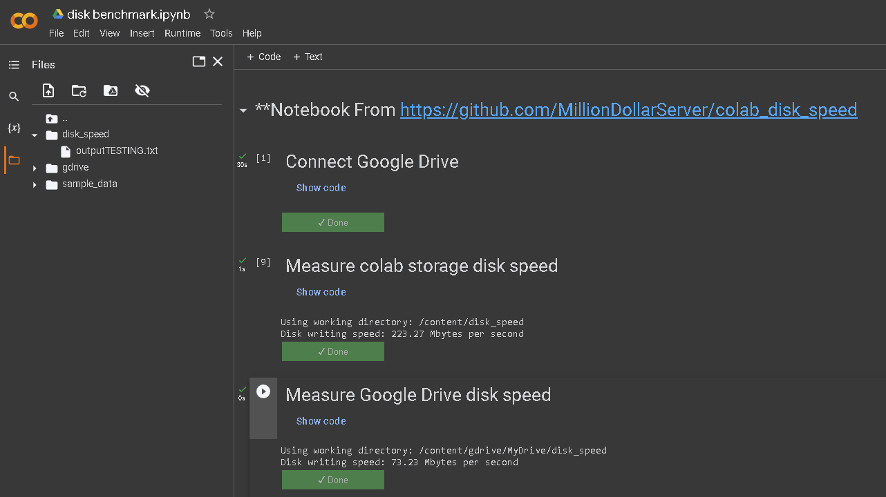

# colab_disk_benchmark
Run disk benchmakr on colab local storage vs Google Drive

| Notebook Name | Link |
| --- | --- |
| [colab Disk Benchmark](https://github.com/MillionDollarServer/colab_disk_benchmark/blob/main/colab_disk_benchmark.ipynb) |  |

